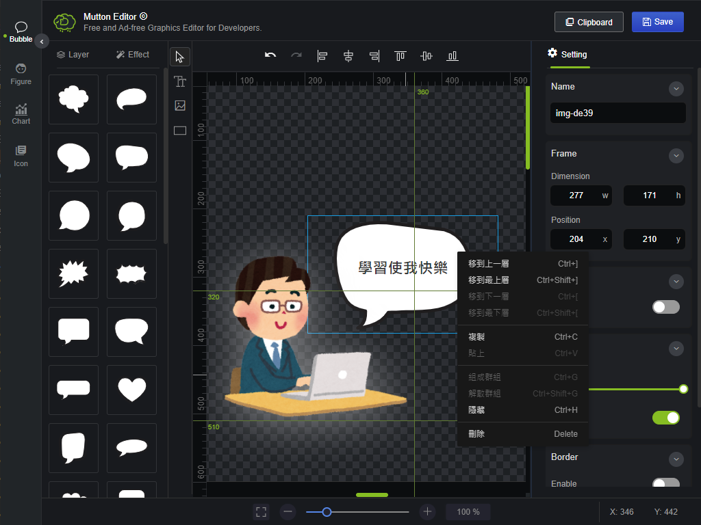

<a href="https://mike-zheng.github.io/mutton-editor" target="_blank" rel="noopener noreferrer">

</a>

  
   

## Mutton Editor

**2022/01** https://mike-zheng.github.io/mutton-editor

Free and Ad-free Graphics Editor for Developers.

-------------

- v1.1.1
  * [add] Add i18n Ja
  * [fix] http resource from pngimg.com

-------------

- v1.1.0
  * [add] Add i18n
  * [add] Aboutme
  * [update] App loader
  * [fix] Error sparking screen when changing order
  * [update] Not support page
  * [add] pngimg.com

- v1.0.4
  * [fix] Resize handler shap
  * [update] Alert message when exceeding localStorage quota

- v1.0.3
  * [add] Placeholders for images
  * [update] Enhance images with base64

- v1.0.2
  * [fix] Focus in text item after dbclick event
  * [add] Show version

- v1.0.1 [2022/01/22]
  * [fix] Images url with https 
  * [fix] Export and Clipboard
  * [fix] Generate all images to base64

- v1.0.0 [2022/01/21]
  * [add] Initial App  